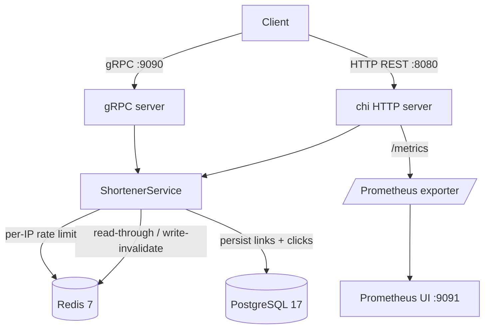
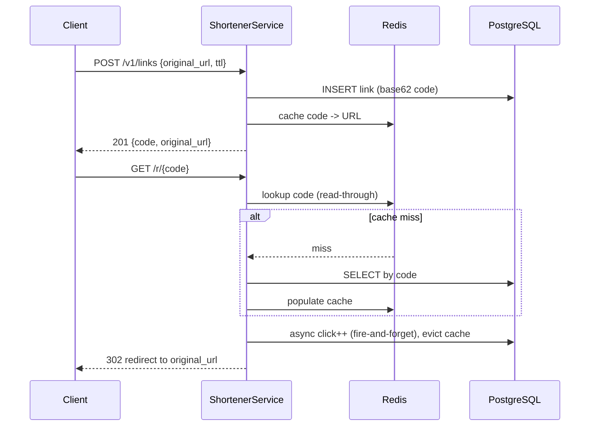

# go-vault

**A production-grade URL shortener microservice written in Go** — dual HTTP + gRPC transports over one shared domain, Redis read-through caching, PostgreSQL persistence, per-IP rate limiting, and Prometheus metrics. Live locally in one command: `docker compose up`.

> Despite the name, go-vault is a URL shortener, not a secrets store. No credentials or vault data live in this repo.

[](LICENSE)
[](https://github.com/chirag127/go-vault/stargazers)
[](https://github.com/chirag127/go-vault/commits)
[](https://github.com/chirag127/go-vault/actions/workflows/ci.yml)
[](go.mod)

## What it is / why it exists

go-vault is a compact but complete reference microservice: create a short code for a URL, resolve it with a redirect, track click stats, and expire links via TTL. It exists to demonstrate a clean, 12-factor Go service with two transports over one shared domain, a read-through cache, and first-class observability — scaffolding you can lift straight into real systems.

## Links

- **Repo:** https://github.com/chirag127/go-vault
- **GitHub Pages:** for oriz web apps the Cloudflare domain is the canonical live site; for this self-hosted service repo, GitHub Pages (https://chirag127.github.io/go-vault/) serves the repo landing/about page only. go-vault itself is a service you run with Docker.

## ⭐ Star this repo

If this is useful, please ⭐ star the repo — it helps others find it.

## Architecture



### Request lifecycle (create + resolve)



## Features

- **Dual transport** — the same `ShortenerService` domain is served over REST (chi/v5) and gRPC, no logic duplicated.
- **Read-through Redis cache** — resolve/get paths hit Redis first; write-invalidate keeps click counts fresh.
- **Per-IP rate limiting** — Redis-backed counter (`RATE_LIMIT_MAX` per `RATE_LIMIT_WINDOW`), fails open on cache errors.
- **Base62 short codes** — configurable length, `crypto/rand`-generated, collision-checked.
- **TTL / link expiry** — optional per-link `ttl_seconds`; cache never serves expired links.
- **Click stats** — per-code click counts, tracked asynchronously.
- **Prometheus metrics** — `/metrics` endpoint + bundled Prometheus UI in the compose stack.
- **12-factor config** — every knob is an env var with a sane default.
- **Graceful shutdown** — gRPC `GracefulStop()` + HTTP `Shutdown()` on SIGINT/SIGTERM with a configurable drain.
- **Structured logging** — `log/slog` JSON with request logging interceptors.
- **Health probes** — `/healthz` (liveness) and `/readyz` (readiness).
- **Distroless image** — multi-stage Docker build, minimal final image.

## Tech stack

| Layer | Technology |
|---|---|
| Language | Go 1.25 |
| gRPC | `google.golang.org/grpc` + `google.golang.org/protobuf` |
| Proto source | Protocol Buffers v3 (`api/proto/shortener.proto`), managed with `buf` |
| HTTP router | `go-chi/chi/v5` |
| Database | PostgreSQL 17 via `jackc/pgx/v5` (pgxpool) |
| Cache + rate limit | Redis 7 via `redis/go-redis/v9` |
| Test cache | `alicebob/miniredis/v2` (in-process Redis for tests) |
| Migrations | Raw SQL (`migrations/`) |
| Metrics | Prometheus `client_golang` |
| Config | `kelseyhightower/envconfig` |
| Logging | `log/slog` (structured JSON) |
| Container | Multi-stage Docker → distroless final image |
| Lint | `golangci-lint` (`.golangci.yml`) |

## Repository structure

```
go-vault/
├── api/
│   ├── proto/            # shortener.proto — gRPC/protobuf service definition
│   └── gen/              # generated protobuf + gRPC stubs (buf.gen.yaml)
├── cmd/
│   └── server/main.go    # entrypoint: wire config -> pg -> redis -> svc -> HTTP+gRPC
├── internal/
│   ├── config/           # envconfig-based 12-factor Config struct
│   ├── codec/            # base62 short-code encoder
│   ├── domain/           # Link entity + typed domain errors
│   ├── repository/       # postgres + in-memory repo (interface-driven)
│   ├── cache/            # Redis read-through cache wrapper
│   ├── service/          # ShortenerService — the core domain logic
│   ├── metrics/          # Prometheus collectors
│   └── transport/
│       ├── http/         # chi REST server + handlers
│       └── grpc/         # gRPC handler + logging/metrics interceptors
├── migrations/           # raw SQL schema migrations
├── deploy/               # deployment assets
├── Dockerfile            # multi-stage distroless build
├── docker-compose.yml    # app + postgres + redis + prometheus
├── buf.yaml / buf.gen.yaml
├── Makefile
├── .golangci.yml
└── CHANGELOG.md
```

## Quick start

```bash
git clone https://github.com/chirag127/go-vault.git
cd go-vault
docker compose up --build
```

This starts the service plus PostgreSQL, Redis, and Prometheus. Endpoints:

- **HTTP REST:** http://localhost:8080
- **gRPC:** localhost:9090
- **Prometheus metrics:** http://localhost:8080/metrics
- **Prometheus UI:** http://localhost:9091

Run locally without Docker (requires Postgres + Redis reachable at the configured addresses):

```bash
make build
./bin/server
```

## Makefile targets

| Target | What it does |
|---|---|
| `make run` | `docker compose up --build` — full stack |
| `make build` | Compile the server binary to `bin/server` (trimmed, stripped) |
| `make test` | `go test -race -count=1 ./...` |
| `make lint` | `golangci-lint run ./...` |
| `make vet` | `go vet ./...` |
| `make proto` | Regenerate protobuf/gRPC stubs (needs `protoc` + plugins) |
| `make clean` | Remove `bin/` |

## Configuration

All configuration is read from environment variables (12-factor). Names and purpose only:

| Variable | Purpose |
|---|---|
| `HTTP_ADDR` | Listen address for the HTTP REST server (default `:8080`) |
| `GRPC_ADDR` | Listen address for the gRPC server (default `:9090`) |
| `DATABASE_URL` | PostgreSQL connection DSN |
| `REDIS_ADDR` | Redis host:port for cache + rate limiting |
| `REDIS_PASSWORD` | Redis auth password (empty by default) |
| `CACHE_TTL` | TTL for cached link lookups |
| `RATE_LIMIT_MAX` | Max requests per IP per window |
| `RATE_LIMIT_WINDOW` | Rate-limit window duration |
| `CODE_LENGTH` | Length of generated base62 short codes |
| `SHUTDOWN_TIMEOUT` | Graceful shutdown drain timeout |
| `LOG_LEVEL` | Log verbosity (`info`, `debug`) |

## API reference

### HTTP REST

| Method | Path | Purpose |
|---|---|---|
| `POST` | `/v1/links` | Create a short link (`{"original_url":"...","ttl_seconds":86400}`) |
| `GET` | `/v1/links` | List links (paginated, `?page_size=`) |
| `GET` | `/v1/links/{code}` | Get link details |
| `GET` | `/v1/links/{code}/stats` | Get click stats |
| `DELETE` | `/v1/links/{code}` | Delete a link |
| `GET` | `/r/{code}` | Resolve — 302 redirect to the original URL |
| `GET` | `/healthz` | Liveness probe |
| `GET` | `/readyz` | Readiness probe |
| `GET` | `/metrics` | Prometheus metrics |

```bash
# Create a short link
curl -X POST http://localhost:8080/v1/links \
  -H 'Content-Type: application/json' \
  -d '{"original_url":"https://example.com","ttl_seconds":86400}'

# Resolve (follow redirect)
curl -L http://localhost:8080/r/xYz9K2m

# Stats
curl http://localhost:8080/v1/links/xYz9K2m/stats
```

### gRPC (grpcurl)

```bash
grpcurl -plaintext -d '{"original_url":"https://example.com"}' \
  localhost:9090 shortener.v1.ShortenerService/CreateLink

grpcurl -plaintext -d '{"code":"xYz9K2m","client_ip":"127.0.0.1"}' \
  localhost:9090 shortener.v1.ShortenerService/Resolve

grpcurl -plaintext -d '{"code":"xYz9K2m"}' \
  localhost:9090 shortener.v1.ShortenerService/Stats
```

## Design highlights

### Caching (read-through, write-invalidate)
Redis is a read-through cache on the `GetLink` and `Resolve` paths. On create, the new link is written to cache immediately. On click increment (fire-and-forget goroutine), the stale entry is evicted so the next read picks up the fresh click count from Postgres. Cache TTL is the minimum of the global `CACHE_TTL` and the link's remaining lifetime — expired links are never served from cache.

### Rate limiting (Redis counter)
Each inbound IP gets a Redis counter key. On each `Resolve`, the key is atomically incremented with an expiry set in a pipeline; over `RATE_LIMIT_MAX` within `RATE_LIMIT_WINDOW` returns `429`. The limiter fails open on Redis errors so a cache outage doesn't block resolves.

### Short code generation (base62)
Codes are configurable-length base62 (`[0-9A-Za-z]`) generated with `crypto/rand` for uniform distribution, with a bounded collision retry.

### Prometheus metrics
| Metric | Type | Labels |
|---|---|---|
| `govault_grpc_request_duration_seconds` | Histogram | `method`, `status` |
| `govault_http_request_duration_seconds` | Histogram | `method`, `path`, `status` |
| `govault_cache_hits_total` | Counter | — |
| `govault_cache_misses_total` | Counter | — |
| `govault_links_created_total` | Counter | — |
| `govault_links_resolved_total` | Counter | — |
| `govault_ratelimit_rejections_total` | Counter | — |

## Part of the oriz family

go-vault is one of ~80 sites and tools in the **oriz** family. See the rest at [blog.oriz.in](https://blog.oriz.in).

## Contributing

Issues and PRs welcome. Run `make lint` and `make test` before submitting. Conventional commits are the changelog.

## License

MIT © Chirag Singhal

## Author

**Chirag Singhal** — [chirag@oriz.in](mailto:chirag@oriz.in)

## Status & roadmap

Stable. The core shortener, dual transports, caching, rate limiting, and metrics are complete. Future ideas: analytics dashboards, custom vanity codes, and a gRPC-gateway REST bridge generated straight from the proto.
